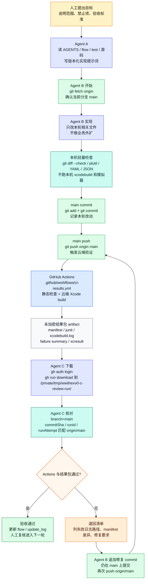
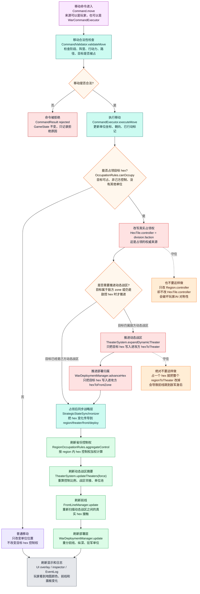
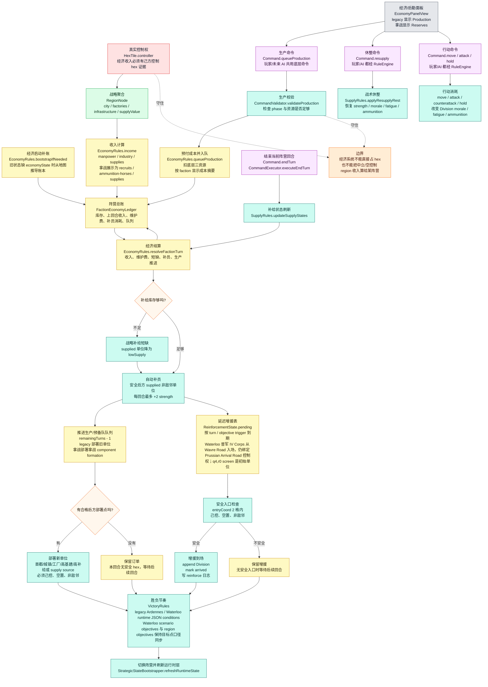
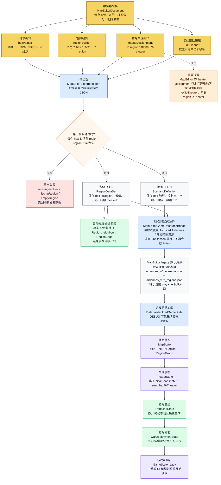
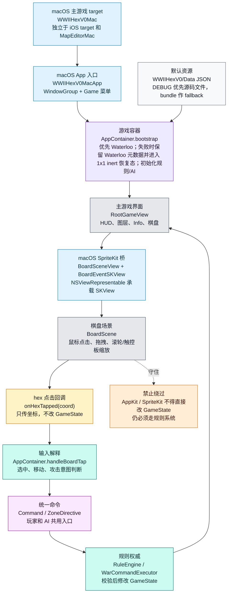
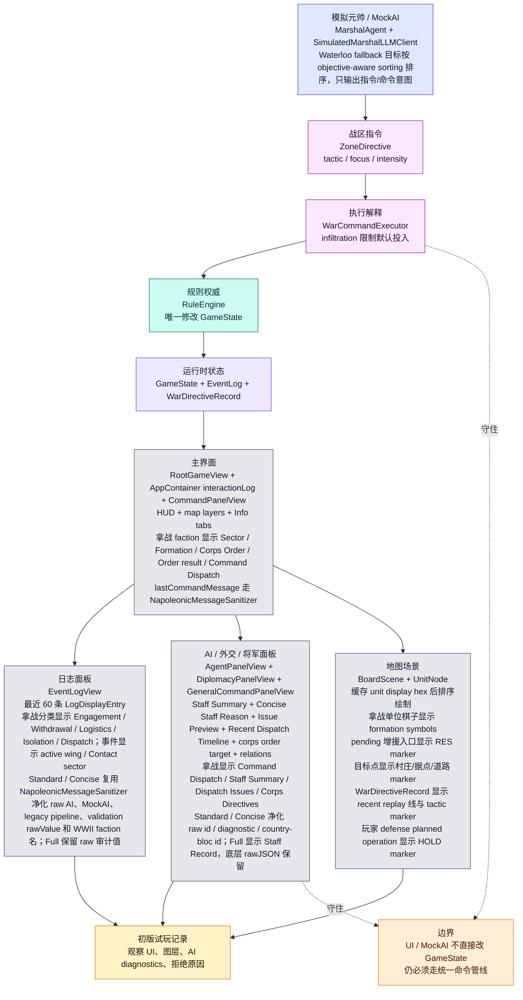
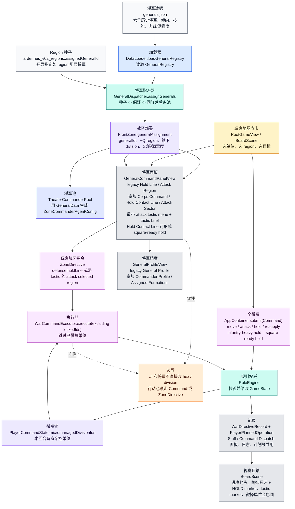

# WWIIHexV0 Mermaid 核心流程图

> 本图参照 `md/flow/flow.md`。每个图块都用“中文解释 + 关键代码名”标注：先看中文理解逻辑，再用代码名回到源码定位。

## 0. 读图总纲

项目当前最重要的逻辑是：

```text
地图编辑器/JSON 数据
  -> 游戏启动加载为 GameState
  -> hex 是真实战术权威
  -> region / theater / front / deploy 都是从 hex 和单位位置派生出来的战略层
  -> economy 是 faction 级经济总账，收入仍从真实控制的 hex/region 聚合
  -> v0.5 元帅层是战略意图层，不替代战术权威
  -> 玩家和 AI 都必须把命令交给 RuleEngine
  -> 命令执行后再同步刷新战略层和 UI
```

图里颜色含义：

- 红色：权威状态，不能被下游反向覆盖。
- 绿色：派生状态，可以重建，但来源必须清楚。
- 蓝色：初始快照/基准状态，不是运行时推进状态。
- 紫色：命令管线，玩家、AI、未来聊天命令都要走这里。

## 0.1 云端协作验证闭环

这张图是项目协作和验证流，不是游戏运行时逻辑。默认只使用 `main` 直推触发云端验证；Agent C 必须下载未加密结果包复核。



## 1. 总主线：从地图数据到游戏行动

这张图看全局。左上是地图数据怎么进入游戏；中间是 hex、region、theater、front、deploy 的分层关系；右侧是玩家/AI 命令如何统一进入规则系统；底部是 UI 和日志怎么读取结果。

```mermaid
flowchart TD
    ME["地图编辑器<br/>MapEditor<br/>用来画格子、省份、战区、初始部队"]:::editor
    JSON["游戏数据 JSON<br/>ScenarioDefinition + RegionDataSet<br/>保存地图、单位、省份、初始战区"]:::data
    SCAT["场景目录<br/>ScenarioCatalog<br/>defaultPlayable 指向 Waterloo 1815 数据切片；Archived Ardennes 作为 legacy 可选剧本保留；defaultPlayerFaction 为 France；目标切片已覆盖 Plancenoit；Wavre Road 是普军后方入口抽象；Papelotte 有 Anglo-Allied 左翼预备；Mont-Saint-Jean 后方 q2,r1 有 Anglo-Allied Rear Road marker；Prussian Approach q4,r0 有开局 screen 和非目标 road marker；q4,r1 目标显示为 Prussian Arrival Road"]:::loader
    SETUP["新局/继续/设置<br/>NewGameSetupView<br/>New Campaign 默认显示 Waterloo、玩家可见为 Player Power / Power / Opening Turn，底层仍是 Faction；Archived Campaigns 才显示 legacy 新局和旧 legacy 存档详情；AppContainer 按玩家控制权归一拿战 phase；Saved Campaign 可选 Slot 1/2/3，可编辑 campaign name，坏快照/未知 scenario/command staff 失败显示原因并可 Clear Campaign；继续成功后走现有 AI eligibility gate；Status 显示操作结果；Settings 调整 Observer Mode、Map View、Dispatch Detail、Staff Pace、Staff Control、Guide Notes、Text Size"]:::input
    SAVE["本地试玩快照<br/>GameSaveSnapshot + GameSaveSlot + UserDefaults<br/>schemaVersion 1，保存 scenario / player faction / GameState；内部仍是 3 个 slot，默认显示 Campaign 1/2/3，Slot 1 兼容旧单槽 key；campaign name 独立保存；拿战摘要显示 Current / Your Power；加载区分 missing / loaded / unavailable；恢复后 Staff 模式含 observer + Staff 可续跑 AI，非 observer Manual 需由 End Orders 推进，observer Manual 为 Observation only / 只读"]:::data
    PSET["试玩偏好<br/>PlaytestSessionSettings + UserDefaults<br/>Observer Mode / Map View / Dispatch Detail / Staff Pace / Staff Control / Guide Notes / Reduce Motion / Text Size；坏设置重置为标准设置并显示 Campaign settings 提示"]:::data
    REPLAY["试玩回放详细度<br/>ReplayDetailLevel<br/>Concise 保留 Staff Summary / Staff Reason / Issue Preview / Recent Dispatch Timeline；Standard / Full 的 Situation 可显示完整 selected staff rationale；控制日志条数、directive limit、metadata、context、明细卡和 Staff Record（底层 rawJSON 保留）审计显示"]:::ui
    GUIDE["非阻塞短引导与 AI 反馈<br/>PlaytestGuideCue + playerOrdersStatus + aiNoActionFeedback + aiDiagnosticFeedback<br/>首次 formation / artillery / cavalry / end orders 写入 Staff note；infantry-heavy formation 提示 square-ready Hold Contact Line；玩家无可行动、AI 无有效命令、record-level issue 和 dispatch paused 给可读提示"]:::ui
    DL["数据加载器<br/>DataLoader.loadGameState<br/>校验 initial phase / faction / terrain / victory；把 JSON 变成可运行 GameState"]:::loader
    TERR["运行时地形规则<br/>TerrainRuleSet / GameState.terrainRules<br/>Waterloo 移动/战斗读取 napoleonic_terrain_rules；旧状态 fallback legacy"]:::rules
    GS["运行时总状态<br/>GameState<br/>一局游戏所有状态都在这里"]:::state

    HEX["战术权威：六角格和单位位置<br/>HexTile.controller + Division.coord<br/>谁占哪个格、单位在哪，先看这里"]:::authority
    REGION["省份战略层<br/>RegionNode<br/>资源、补给、胜利点；控制权由 hex 聚合"]:::derived
    INIT["开局战区快照<br/>TheaterInitialSnapshot<br/>记录地图编辑器给的初始战区"]:::snapshot
    R2T["基础战区映射<br/>regionToTheater<br/>只作初始/基准，不表示战线推进"]:::snapshot
    H2T["动态战区权威<br/>hexToTheater<br/>运行时推进只改具体 hex"]:::authority
    FRONT["前线层<br/>FrontLine / FrontSegment<br/>按双方动态战区的真实相邻 hex 生成"]:::derived
    DEPLOY["部署层<br/>WarDeploymentState<br/>用 hexToFrontZone 把单位分成前线/纵深/驻军"]:::derived
    ECO["经济总账<br/>EconomyState / EconomyRules<br/>收入、维护费、生产队列、自动补员"]:::economy
    DIP["外交敌我关系<br/>DiplomacyState<br/>hostile / friendly 查询统一补给、前线、部署和 AI 口径"]:::rules
    PLAYER["玩家输入<br/>点击地图、移动、攻击、结束回合"]:::input
    AI["AI 战略上游<br/>RulerAgent + MarshalAgent<br/>先定国家姿态，再做大战役级规划"]:::input
    POST["战略姿态 JSON<br/>StrategicPostureEnvelope<br/>offensive / defensive / coalition / stabilize"]:::command
    PDEC["战略姿态解码<br/>StrategicPostureDecoder<br/>校验 schema / issuer / turn / faction / zone / region"]:::command
    DEC["元帅 JSON 解码<br/>TheaterDirectiveDecoder<br/>提取 fenced JSON、校验 id 与 schema"]:::command
    COMP["元帅意图编译<br/>TheaterDirectiveCompiler<br/>把 TheaterDirective 降级成 ZoneDirective<br/>已选 rationale 汇入 theaterContext"]:::command
    ZD["战争指令<br/>ZoneDirective<br/>战区级 attack/defend 意图"]:::command
    WCE["指令翻译器<br/>WarCommandExecutor<br/>把战区意图翻成具体单位命令"]:::command
    CMD["底层命令<br/>Command<br/>move / attack / hold / resupply / queueProduction / endTurn"]:::command
    RE["规则引擎<br/>RuleEngine<br/>先校验，再真正修改 GameState"]:::rules
    SYNC["战略同步器<br/>StrategicStateSynchronizer<br/>占领后刷新省份、战区、前线、部署"]:::rules

    UI["地图和面板显示<br/>SpriteKit / SwiftUI Overlay<br/>显示 hex、省份、初始战区、动态战区、前线、部署"]:::ui
    LOG["日志和复盘记录<br/>EventLog / WarDirectiveRecord / AgentDecisionRecord / RulerDecisionRecord<br/>用于 UI 展示和后续调试"]:::ui

    ME --> JSON --> SCAT --> SETUP --> DL --> GS
    SETUP --> SAVE --> GS
    PSET --> SETUP
    SETUP --> PSET
    SETUP --> REPLAY --> UI
    REPLAY --> LOG
    GS -.Save Campaign.-> SAVE
    GS --> HEX
    HEX --> REGION
    HEX --> ECO
    REGION --> ECO
    REGION --> INIT
    INIT --> R2T
    R2T -.->|缺失时只用来补初始值| H2T
    HEX --> H2T
    H2T --> FRONT --> DEPLOY
    GS --> ECO
    GS --> DIP
    GS --> TERR

    PLAYER --> CMD
    PLAYER --> GUIDE --> LOG
    AI --> POST --> PDEC --> DEC --> COMP --> ZD --> WCE --> CMD
    CMD --> RE --> HEX
    RE --> ECO
    TERR --> RE
    RE --> SYNC
    SYNC --> REGION
    SYNC --> H2T
    SYNC --> FRONT
    SYNC --> DEPLOY

    GS --> UI
    HEX --> UI
    REGION --> UI
    INIT --> UI
    H2T --> UI
    FRONT --> UI
    DEPLOY --> UI
    ECO --> UI
    DIP --> UI
    RE --> LOG
    WCE --> LOG

    classDef editor fill:#f6d365,stroke:#8a5a00,color:#1f1b10
    classDef data fill:#f8f9fb,stroke:#6b7280,color:#111827
    classDef loader fill:#dbeafe,stroke:#2563eb,color:#0f172a
    classDef state fill:#ede9fe,stroke:#7c3aed,color:#1f143d
    classDef authority fill:#fee2e2,stroke:#dc2626,color:#111827
    classDef derived fill:#dcfce7,stroke:#16a34a,color:#052e16
    classDef snapshot fill:#e0f2fe,stroke:#0284c7,color:#082f49
    classDef input fill:#fef3c7,stroke:#d97706,color:#1f1600
    classDef economy fill:#fef9c3,stroke:#ca8a04,color:#292107
    classDef command fill:#fae8ff,stroke:#a21caf,color:#2a0a2f
    classDef rules fill:#ccfbf1,stroke:#0f766e,color:#042f2e
    classDef ui fill:#e5e7eb,stroke:#4b5563,color:#111827
```



## 2. 占领与动态推进：一个单位移动后发生什么

这张图只看最容易出 bug 的链路：单位移动到敌控空格后，游戏如何占领这个 hex，并且只推进这个 hex 的动态战区和部署归属。

核心原则：占一个 hex，只改这个 hex 的 `hexToTheater` / `hexToFrontZone`；不能把整个 region 的 `regionToTheater` 改掉。



## 3. v0.8 经济、生产与补员链路

这张图看 v0.8 初级经济和 v3.5 起步的拿战后勤展示兼容层。经济总账是 faction 级资源池，但收入和部署资格仍回到真实 hex 控制和 region 聚合；生产命令仍走 `RuleEngine`，UI 不直接改 `GameState`。v3.5 还新增最小 delayed reinforcement schedule、`Division` 级 morale / fatigue / ammunition 战术消耗和 Waterloo 专用胜负节奏；仍不新增完整 ammunition / horses 经济账本字段。



## 4. AI / 统治者-元帅决策链：AI 怎么下命令

这张图看 v0.5/v3.4 当前默认 AI 主路径。AI 不直接控制单位，也不直接改地图；统治者先生成 `StrategicPostureEnvelope`，元帅再读取降维战场摘要和 posture，模拟 LLM 输出 `TheaterDirectiveEnvelope` JSON，经 decoder 校验和 compiler 降级后，形成战区级 `DirectiveEnvelope`。`WarCommandExecutor` 再把这些战术翻译成底层 `Command`，最后交给 `RuleEngine`。

当前默认 AI 主线是 `RulerAgent -> StrategicPostureEnvelope -> StrategicPostureDecoder -> MarshalAgent -> TheaterDirective JSON -> TheaterDirectiveDecoder -> TheaterDirectiveCompiler -> ZoneDirective -> WarCommandExecutor -> RuleEngine`。旧 v0.37 `TheaterCommanderPool -> ZoneCommanderAgent` 作为 fallback 和显式 `.zoneDirective` 路径保留。敌我摘要、攻击校验、ZOC、占领、前线邻接、部署分类和战区压力已开始读取 `DiplomacyState.isHostile/isFriendly`。统治者层只写战略姿态和审计记录，不直接执行命令。旧 Agent D 管线仍保留，但默认不走。

```mermaid
flowchart TD
    START["触发 AI 行动<br/>AppContainer.advanceOrRunAI / runAIIfNeeded<br/>玩家点下一回合、命令后轮到 AI，或继续存档恢复后"]:::input
    CHECK{"当前 activeFaction 该自动触发 AI 吗?<br/>phase.allowsCommands<br/>Staff Control = Staff<br/>非 observer 下不是 playerFaction<br/>observer 可让玩家方也自动跑"}:::decision
    STOP["不运行 AI<br/>Manual 非 observer 可用 End Orders 推进当前 activeFaction<br/>observer Manual 保持 Observation only / 只读"]:::stop
    REFRESH["行动前刷新运行时战略层<br/>StrategicStateBootstrapper.refreshRuntimeState<br/>避免 AI 读到旧前线/旧部署"]:::rules
    TM["AI 回合编排器<br/>TurnManager.runAITurn<br/>默认 pipelineMode = marshalDirective"]:::rules
    DIPREL["敌我/友军关系查询<br/>DiplomacyState.isHostile / isFriendly<br/>给补给、目标、ZOC、占领和前线统一口径"]:::rules
    RULER["统治者战略姿态<br/>RulerAgent.resolvePosture<br/>生成 StrategicPostureEnvelope 和 RulerDecisionRecord"]:::ai
    SPDEC["姿态解码校验<br/>StrategicPostureDecoder<br/>schema / issuer / turn / faction / zone / region"]:::command
    SUM["战场摘要<br/>MarshalBattlefieldSummarizer<br/>读取 front/deploy/目标/补给/士气/疲劳/弹药/敌骑兵摘要<br/>敌我判断来自 DiplomacyState"]:::ai
    LLM["模拟 LLM 客户端<br/>SimulatedMarshalLLMClient<br/>输出 fenced JSON，不接真实网络或模型"]:::ai
    DEC["元帅 JSON 解码器<br/>TheaterDirectiveDecoder<br/>提取 JSON、解码、校验 schema/zone/region/tactic"]:::command
    COMP["元帅意图编译器<br/>TheaterDirectiveCompiler<br/>TheaterDirective -> ZoneDirective<br/>传递 focus/convergence/coordinated 参数<br/>最多 3 条已选 rationale 写入 theaterContext"]:::command
    ENV["指令信封<br/>DirectiveEnvelope<br/>收集编译后的 ZoneDirective"]:::command
    TACTIC["高级战术路由<br/>TacticName<br/>blitzkrieg / cavalryCharge / spearhead / breakthrough / pincer / artilleryPreparation / fire / feint / guerrilla / hold / elastic / depth / lastStand<br/>敌骑兵压力偏向 Hold Line"]:::command
    WCE["指令执行器<br/>WarCommandExecutor.execute<br/>按战术 profile 选择单位、目标和 fallback；broken morale offensive order 降级为 Hold"]:::command
    BOTTOM["具体单位命令<br/>Command<br/>attack / move / hold / allowRetreat"]:::command
    RE["统一规则校验执行<br/>RuleEngine<br/>AI 和玩家共用同一套规则"]:::rules
    RECORD["指令复盘记录<br/>WarDirectiveRecord<br/>记录 tactic、target、结果、diagnostics<br/>AgentPanel 拒绝原因预览来源"]:::ui
    END["AI 自动结束回合<br/>RuleEngine.execute(.endTurn)<br/>切换 activeFaction / phase"]:::rules

    START --> CHECK
    CHECK -->|否| STOP
    CHECK -->|是| REFRESH --> TM --> DIPREL --> RULER --> SPDEC --> SUM --> LLM --> DEC --> COMP --> ENV
    ENV --> TACTIC --> WCE --> BOTTOM --> RE --> RECORD --> END

    FALLBACK["Fallback 将军池<br/>TheaterCommanderPool + ZoneCommanderAgent<br/>元帅 JSON 无效或某 zone 无指令时使用"]:::ai
    DEC -.解码失败.-> FALLBACK --> ENV
    COMP -.zone 缺指令.-> FALLBACK

    LEGACY["旧 Agent D 管线<br/>AgentContext -> DecisionProvider -> AgentCommandMapper<br/>只在 legacyAgentOrder 显式分支或测试中使用"]:::legacy
    TM -.默认不走.-> LEGACY

    MANUAL["手写战区指令<br/>手工 ZoneDirective<br/>玩家聊天命令也可以直接指定 tactic/focus/convergence"]:::input
    MANUAL --> TACTIC

    classDef input fill:#fef3c7,stroke:#d97706,color:#1f1600
    classDef decision fill:#fff7ed,stroke:#ea580c,color:#1f1300
    classDef stop fill:#fee2e2,stroke:#b91c1c,color:#111827
    classDef rules fill:#ccfbf1,stroke:#0f766e,color:#042f2e
    classDef ai fill:#e0e7ff,stroke:#4f46e5,color:#111827
    classDef command fill:#fae8ff,stroke:#a21caf,color:#2a0a2f
    classDef ui fill:#e5e7eb,stroke:#4b5563,color:#111827
    classDef legacy fill:#f3f4f6,stroke:#6b7280,stroke-dasharray:5 5,color:#111827
```



## 5. MapEditor 到游戏数据：地图怎么进入主游戏

这张图看地图编辑器的输出链路。编辑器里画的是初始地图和初始战区；运行时动态战区仍由游戏里的 `hexToTheater` 推进，不是编辑器脚本控制。



## 6. v1.1 主游戏 macOS 入口

这张图只说明 v1.1 新增的 macOS 主游戏 target。它复用主游戏数据、UI、SpriteKit 棋盘和规则系统；macOS 输入只是平台桥接，不是新的规则入口。



## 7. v1.0 UI / AI / 初版试玩链路

这张图说明 v1.0 分支的收口点：它不新增规则入口，只改善 UI 可读性、AI 回放、轻量性能和试玩记录。



## 8. v0.4 将军与玩家双轨命令

这张图说明 v0.4 分支的新增主线：实体将军从 JSON / region 种子接入 FrontZone；玩家可以微操具体部队，也可以通过将军面板发战区宏观命令。两条路最终仍收口到规则系统。


